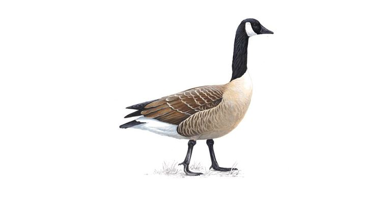

# WWF Report on Canada Goose (_Branta canadensis_) in the United States

#### Author: Hayward Wong
#### Published date: 18th November 2021

 

**Scientific name:** _Branta canadensis_

**Common Name:** Canada goose


# Introduction

The Canada goose (Branta canadensis) is a large wild goose with a black head and neck, white cheeks, white under its chin, and a brown body. It is native to the arctic and temperate regions of North America, and it is occasionally found during migration across the Atlantic in northern Europe. Like most geese, the Canada goose is primarily herbivorous and normally migratory; it tends to be found on or close to fresh water.

The Canada goose was believed to be extinct in the 1950s due to overhunting and loss of habitat. After restoration efforts in the 1960s, the Canada goose populations were reestablished, and with improved game laws and habitat recreation and preservation programs, their populations have recovered in most of their range. The success of Canada geese has led to its often being considered a pest species because of its excrement, its depredation of crops, its noise, its aggressive territorial behavior toward both humans and other animals, and its habit of stalking and begging for food. 


Extremely adept at living in human-altered areas, many Canada geese populations have now become non-migratory and settled in urban and cultivated habitats, which provide food and few natural predators. Previously, the species is known to migrate from their breeding grounds in Canada to their winter ranges in parts of the United States. As populations start to settle and not migrate, it is evermore important for WWF to understand the population trend over time and across landscapes inorder to cope with the impacts that come along.

In this report, we will investigate factors influencing changes in abundance of Canada Goose in the United States using modelling approaches.


# Research Question

The initial focus of the report is to investigate how the population trends of Canada Goose in the US varies across time and biomes. However, because the US data we used have only two different ```biomes``` and most factors in our data set are identical across observations, we decidede to also include locations of observations as it is the most diverse factor.

# Hypothesis

The overall abundance of Canada Goose in the US will differ across different biomes and increase over time. This is in line with prior knowledge where many goose populations have now become non-migratory and settled in warmer biomes due to lack of natural predator and increased resource availability. Canada goose was believed to be extinct in the 1950s due to overhunting and loss of habitat. After restoration efforts in the 1960s, the Canada goose populations were reestablished therefore the expected increase in population over time.


# Statistical Analysis


```{r, include = FALSE}
source("script/Goose_script.R", local = knitr::knit_global())
```


We used the population data from The Living Planet Index (LPI) to construct a mixed effect model estimating the population changes of Canada Goose in the US over time and across biomes, they are open source and are available to any registered users.

For Canada Goose in the US, data are sourced from the following studies.

```{r, echo = FALSE}
US_goose %>%
  group_by(Data.source.citation) %>%
  summarize(n = n()) %>%
  ungroup() 
```


The original data aggregated data collected from multiple observational studies, we first check if the units across observations are identical, and although there are 3 different levels, they are all individual counts.

```{r, echo = FALSE}
US_goose %>%
  group_by(Units) %>%
  summarize(n = n()) %>%
  ungroup() 
```


## Normal Distribution

As the units for the observations are identical, we then move on to check if the distribution of data is normal.

```{r, echo=FALSE, fig.cap = "Normal distribution of abundance before scaling"}
ggplot(data = US_goose, 
       aes(x = pop)) +
  geom_histogram(bins = sqrt(nrow(US_goose)))
```
And the distribution seems to be left skewed.


We then tried different ways of scaling our data including range scaling, standardization scaling and logarithmic transforming the data, and we settled on using the logarithmic transformed data.

```{r, echo = FALSE}
ggplot(data = scalegoose, 
       aes(x = year, y = logpop, colour = Location.of.population)) +
  geom_point()+
  labs(title = "Goose Population Over Time Across Location of Observations", x = "Year", y = "log(Population)", colour = "Locations") 

```

# Model Analysis

## Model Building

### Hierarchical linear models

### Base Models

We first construct our base models, in response to `year`, `biome`, and `Location.of.population` respectively.


**goose_bm1** 
> ```log(Population)``` against```year```

$$
log(Population) \sim year
$$

**goose_bm2**
> ```log(Population)``` against```biome```

$$
log(Population) \sim biome
$$

**goose_bm3**
>```log(Population)``` against```Loations```

$$
log(Population) \sim location
$$


### Mixed effect Models

We then constructed mixed effect models that involves combinations of the 3 variables. 

Because our initial question is focusing on how Canada Goose population changes over time and if there is a differnce in population across biomes, we set ```year``` and ```biome``` as fixed effects.

**goose_m1**
> Mixed model of ```log(Population)``` against ```year``` and ```biome```

$$
log(Population) \sim year + biome
$$

We also tried to replace ```biome``` with a random effect, ```Location.of.population``` to compare model fitness later, as the US data we used have only two levels for ```biome```.

**goose_m2**
> Mixed model of ```log(Population)``` against ```year``` and ```location```

$$
log(Population) \sim year + (1|location)
$$

We then constructed a mixed effect model that aggregates all 3 variables. 

**goose_mm**
> Mixed model of ```log(Population)``` against fixed effect```year``` and ```biome``` and random effect ```location```

$$
log(Population) \sim year + biome + (1|location)
$$


We then compared these models using the Akaike information criterion (AIC) to determine the prediction error and thereby relative quality of statistical models for a given set of data.

```{r, echo+FALSE}
AICc(goose_bm1, goose_bm2, goose_bm3, goose_m1, goose_m2, goose_mm)

```

We found our model with ```year``` as fixed effect and ```location``` as random effect resulted in the lowest AICc (AICc = 377.0792) despite having the highest degree of freedom (df = 12).  which indicates out of our 6 proposed models, mixed model 2 ```goose_m2``` retains the highest model likelihood and has substantial explanatory power in predicting population abundance of Canada Goose in the US.  We therefore select ```goose_m2``` as our model for visualization and diagnostics.


## Model analytics

Below is the summary output of the selected mixed model.

```{r, echo=FALSE}
summary(goose_m2)
```

From the summary we can see that p-value ≤ 0.05 at (p-value: < 2.2e-16), which suggests a higher chance that the data is statistically significant and the null hypothesis is rejected.


## Model Visualisation

The plot below plots a fitted line using the selected model and logarithmic transformed population trend of Canada goose in the US over the years and how they differ by Locations.

```{r, echo=FALSE}
ggplot(pred.mm) +
  geom_line(aes(x = (x+1969), y = predicted), size = 0.5) +
  geom_ribbon(aes(x = (x+1969), ymin = predicted - std.error, ymax = predicted + std.error), 
              fill = "gray", alpha = 0.5) + 
  geom_point(data = scalegoose, aes(x = year, y = logpop, colour = Location.of.population)) +
  theme(legend.position = "bottom") +
  labs(x = "Year", y = "log(population)", 
       title = "Change in US Canada Goose Population Over Time")+
  labs(colour="Location")+
  theme(plot.title = element_text(size = 15, hjust = 0.5)) 

```

As shown in the plot above, the fitted line have a relatively small error margin and seems to predict most population trends quite well except for one obvious outlier, Aleutian Island.

We then plot the influence of each level of the random effect ```location``` had on our model output.

```{r, echo=FALSE}
plot_model(goose_mm, type = "re", show.values = TRUE)
```

We can see Aleutin Island mentioned above, in fact deviates the most from the model output.

## Conclusion

This report produced a mixed linear model predicting the population trend of Canada Goose in the US using year of observation and biome of the goose population as fixed effect and the location of observation as random effects, and after using AICc, we found that the mixed model that only includes year and location works best. 


Because we showed that year as fixed effects and location as random effect is significant explanatory factors for changes in population abundance, which is in line with part of our hypothesis that the Canada Goose population in the US increase over time.

However, it also means that biome as a fixed effect is not as significant, at least when using the current data. This is largly because of the lack of levels for biome, but as of now, we reject our initially registered hypothesis that population abundance differ across biomes.


