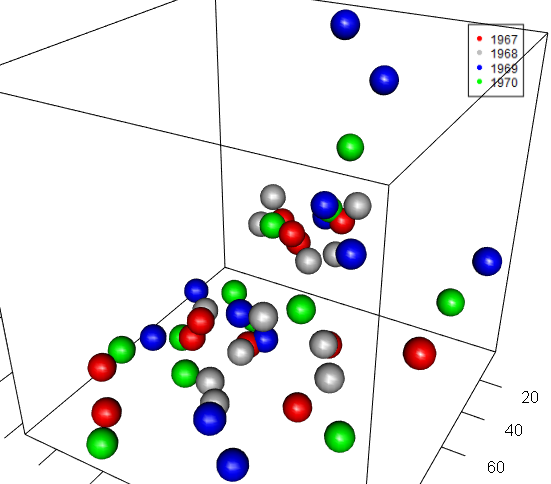

```{r echo = FALSE,inclue = FALSE}

knitr::opts_chunk$set(echo = TRUE)

```


### Tutorial Aims and steps:

#### 1. [Understanding rgl](#intro)

#### 2. [Plotting 3D plots with rgl](#plot)

#### 3. [Setting up view point for rgl plot](#view)

#### 4. [Displaying an interactive rgl plot ](#display)


Today we will be using the``rgl`` package to create interactive 3D Scatterplots of our data.


## 1. Introduction to ``rgl``
{: #intro}

``rgl`` is a 3D graphics package that produces a real-time interactive 3D plot. It allows to interactively rotate, zoom the graphics and select regions. 

### Downloading ``rgl``

To get 3D plots working in RStudio, the first thing you need is the ``rgl`` package, which you can get from [CRAN](https://cran.r-project.org/web/packages/rgl/index.html) by running the following commands in R or RStudio:

```r
install.packages("rgl")
```


## 2.Downloading data 

We will use four calendar years of hyrdrological data for the Catchwater Catchment in Holderness, Yorkshire and another imaginery set of data, including daily rainfall, runoff and evaporation in this tutorial.


The data for this tutorial can be downloaded from [this repository](https://hayward-wong.github.io/3D-datavis/). Clone and download the repo as a zipfile, then unzip and set the folder as your working directory by running the code below (replacing with your actual folder path), or clicking `Session/ Set Working Directory/ Choose Directory` from the RStudio menu.

Alternatively, you can fork [the repository](https://hayward-wong.github.io/3D-datavis/) to your own GitHub account and then add it as a new RStudio project by copying the HTTPS/SSH link. For more details on how to register on GitHub, download Git, sync RStudio and Github and use version control, please check out our [Git tutorial](https://ourcodingclub.github.io/tutorials/git/).

Make a new script file through clicking `File/ New File/ R Script`, give it a title and some information, and we are all set to explore 


```r
## 3D graphics in R
## Data visualisation tutorial
## YOUR NAME
## DATE
#
# Load libraries ----
library(tidyverse)  # For data manipulation
library(rgl)  # For 3D data visualisation

setwd("PATH_TO_FOLDER")  # Set working directory to the folder where you saved the data

# Read in data ----
catchwater <- read.csv("Catchment_data_1967-1970.csv")

```
We will first explore our dataset using the `str()` function, which shows what type each variable is. What is the dataset made of?


```r
str(catchwater)

# Year - Year when the data is collected
# Month - Month when the data is collected
# Time - Month and Year the data is collected
# Rain..mm.day. - mean daily rainfall for the month in mm/day
# Discharge..mm.day. - mean daily discharge for the month in mm/day
# Evap..mm.day - mean daily evaporation for the month in mm/day

```

We then can name the 3 numeric variables into x,y & z respectively.

```
#transform the 3 numeric columns into x,y & z 
x <- rain <- catchwater$Rain..mm.day. 
y <- disc. <- catchwater$Discharge..mm.day.
z <- evap. <- catchwater$Evap..mm.day.
```


## 3.Plotting 3D plots with ``rgl``
{: #plot}

You then use the ``plot3d``  function from ``rgl`` to plot the data in a 3D scatter plot.

<center>  </center>

```r
plot3d(x,y,z) #Plotting x,y & z variables

```
Using the ``rgl.snapshot()``function, we can save a screenshot of the output into .png format. Its often good to close the current device first before starting a new plot, this can be done with the ``rgl.close()`` function.
```r
rgl.snapshot("initial.png") #taking screenshot of the device

rgl.close() #closing the devcie

```


### Adding colours to the plot

To add colours to categorise the scattered points, we will need to add a new column that tells us what colour should be used for each category. This can be done using the ``mutate`` function. For more details on the ``mutate()`` function and data manipulation, please check out our [Git tutorial]({{ https://ourcodingclub.github.io/tutorials/data-manip-intro/).

```r
catchment_data <- catchwater %>% 
  mutate(year_colour = case_when(Year == "1967" ~ "red", 
  #when year is 1967 data is categorised as red
                                 Year == "1968" ~ "white",
                                 Year == "1969" ~ "blue",
                                 Year == "1970" ~ "green",
                                 TRUE ~ NA_character_)) 
                            #If its not one of the 4 years it will return NA
```

<center>  </center>

After adding the new column ``yeaer_colour`` with the corresponding colour for each year, we can use data from that column to colour the data points based on the year they're taken in.

```
plot3d(x,y,z, 
       col = catchment_data$year_colour) 
       #colour of data points based on year_colour
       
rgl.snapshot("coloured.png") #taking a screenshot of the plot

rgl.close() #closing the current device
```


### Changing the style of scatter points
<center>  </center>

We can also change the style of scatter points to better visualise the data. There are different types of shapes available, with points,``p``, as default, spheres ``s``, vertical lines ``h`` useful to accentuate x-y location of points and more. Here we decided to try spheres. 

```
plot3d(x,y,z,
       col = catchment_data$year_colour,
       type = "s", #data points displayed as spheres
       radius = 5) #changing the radius of spheres
       
rgl.snapshot("spheres.png") #taking screenshot of the device

rgl.close() #closing the current device

```


### Adding axis labels 

<center>  </center>


Adding axis labels is pretty straightforward, all we have to do is adding ``xlab``, ``ylab``, ``zlab`` and naming them.

```
plot3d(x,y,z,
       col = catchment_data$year_colour,
       type = 's', 
       radius = 5,
       xlab = "Rainfall mm/day", 
       ylab = "Discharge mm/day", 
       zlab = "Evaportation mm/day") # labelling the x, y & z axis

rgl.snapshot("figures/labels.png") #taking screenshot of the device

```


### Adding the legend

<center>  </center>

We can then add legend to the plot, and it can be done using the ``legend3d()`` function.

```r
legend3d("topright", legend = c("1967","1968","1969","1970"), 
                              # adding the 4 different years
         pch = 16, # selecting the shape in the legend, circle in this case
         col = c("red","grey","blue","green"), 
               # adding the 4 corresponding colours
         inset = c(0.05)) #inset legend from the boarders
```


## 4. Setting up viewpoints for ``rgl`` plots
{: #view}

The default viewpoint orientation for rgl plots is not ideal, therefore its important for us to change the viewpoints ourselves.

### Changing the viewpoints

<center>  </center>

theta and phi are the polar coordinates, to adjust the orientation of viewpoints, we need to change theta and phi.

```r
rgl.viewpoint(theta = 30, phi = 30) #Changing the viewpoint angles
 
rgl.snapshot("viewpoint.png") #taking screenshot of the device

rgl.close() #closing the current device

```

### Zooming in or out

#### Zoomed in
<center>  </center>

#### Zoomed out
<center>  </center>

To zoom in or out, all we have to do is add ``zoom =`` in the ``rgl.viewpoint()`` function. This is based on a zoom factor, so to zoom in, pick a value below 1, and to zoom out, pick a value above 1. 

```r
#Zooming in
rgl.viewpoint(theta = 30, phi = 30, zoom = 0.5) 
 
rgl.snapshot("zoomin.png") #taking screenshot of the device

rgl.close() #closing the current device

#Zooming out
rgl.viewpoint(theta = 30, phi = 30, zoom = 1.5) 
 
rgl.snapshot("zoomout.png") #taking screenshot of the device

rgl.close() #closing the current device

```


## 5. Displaying an interactive ``rgl`` plot in an R Markdown document
{: #display}

A very important feature of the ``rgl`` package that makes it stands out from other 3D plotting packages is its interactiveness. the ``rglwidget()`` function allows the plot to be embedded interactively in a rmarkdown file. Also note that the interactive plots only work when the output format is .HTML.

```r
rglwidget(elementId = "plot")

```

You can then save the interactive plot as an .HTML file.

```
htmlwidgets::saveWidget(rglwidget(), 
                        file = "3dscatter.html",
                        selfcontained = FALSE)

```
```{r, message = FALSE, echo = FALSE, warning = FALSE}

library("tidyverse")
library("rgl")
library("plot3D")

catchwater <- read.csv("data/Catchment_data_1967-1970.csv")

catchment_data <- catchwater %>% 
  mutate(year_colour = case_when(Year == "1967" ~ "red",
                                 Year == "1968" ~ "grey",
                                 Year == "1969" ~ "blue",
                                 Year == "1970" ~ "green",
                                 TRUE ~ NA_character_))

plot3d(x = catchment_data$Rain..mm.day.,
       y = catchment_data$Discharge..mm.day.,
       z = catchment_data$Evap..mm.day., 
       col = catchment_data$year_colour,
       type = 's', 
       radius = 5,
       xlab ="Rainfall mm/day", 
       ylab = "Discharge mm/day", 
       zlab = "Evaportation mm/day")

legend3d("topright", legend = c("1967","1968","1969","1970"), 
pch = 16, col = c("red","grey","blue","green"),  inset=c(0.02))

rglwidget(elementId = "plot4")

```


<hr>
<hr>

<h3>&nbsp; You can contact us with any questions on <a href="mailto:ourcodingclub@gmail.com?Subject=Tutorial%20question" target = "_top">ourcodingclub@gmail.com</a></h3>
<br>
<h3>&nbsp; Related tutorials:</h3>
 - [Intro to github for version control](https://ourcodingclub.github.io/tutorials/git/)
 - [Coding etiquette](https://ourcodingclub.github.io/tutorials/etiquette/)
 - [Basic guide to data manipulation](https://ourcodingclub.github.io/tutorials/data-manip-intro/)
 - [Basic guide to data visualisation](https://ourcodingclub.github.io/tutorials/datavis/)
 - [Creating interactive web apps using shiny](https://ourcodingclub.github.io/tutorials/shiny/)


<ul class="social-icons">
	<li>
		<h3>
			<a href="https://twitter.com/our_codingclub" target="_blank">&nbsp;Follow our coding adventures on Twitter! <i class="fa fa-twitter"></i></a>
		</h3>
	</li>
</ul>


